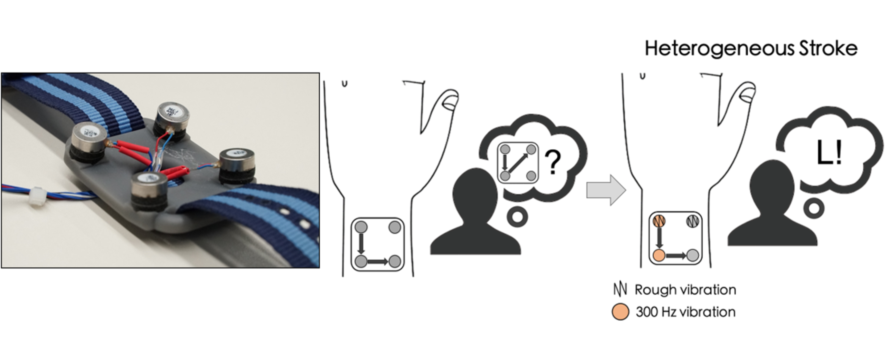
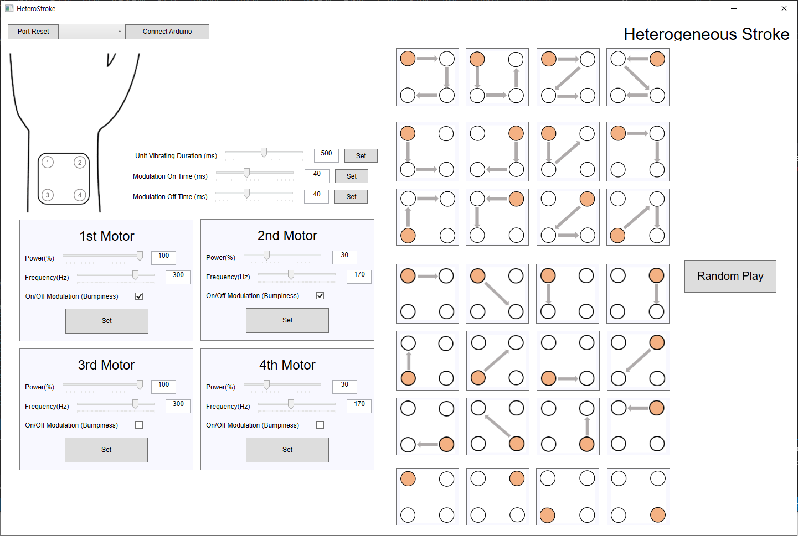

## Heterogeneous Stroke: Using Unique Vibration Cues to Improve the Wrist-Worn Spatiotemporal Tactile Display (ACM CHI 2021)

    

-----------------

Have you ever imagined reading texts through your skin? Heterogeneous Stroke is a design concept that utilizes unique vibrations for each actuators to help users better recognize the tactile "stroke". Since a single tactile "stroke" consists of mutually distinctive (=heterogeneous) vibration stimuli, we decided to call this idea "Heterogeneous Stroke". This project was published in [CHI 2021](https://chi2021.acm.org/).
More information about this work can be found in: [Paper](https://taejun13.github.io/paper/heteroStroke_paper.pdf) | [DOI](https://dl.acm.org/doi/abs/10.1145/3411764.3445448) | [Video](https://youtu.be/Qc-zFCvWwCI)

    
     
    Example usage of Heterogeneous Stroke

## What does this repository contain?

This repository provides materials for reproducing our work:
* Sandbox program (C#) of Heterogeneous Stroke interface
* Arduino firmware codes that offers independent control of each vibration motors.
* 3D model (.stl) of watch frame
* Misc. information (e.g., actuator models, Operating Voltages...)

## Sandbox Program

    

You can compose unique vibrations, and produce the Heterogeneous Stroke in Sandbox Program!

## Misc. Information

* We used BD6221 motor driver to implement micro-level PWM control for LRA motors (BD6221 Datasheet: http://www.datasheetq.com/datasheet-download/308094/1/ROHM/BD6221)
* We used LRA motor of 10 mm diameter and 3.6mm thickness, with 170 Hz resonance frequency. (Model used in our paper was provided from Samsung Electro-mechanics but it's not buyable for public. Thus, we leave the specs here)
* On a 3D printed watch frame with a size of 40 x 40 mm^2, four vibration motors were attached in a 2 x 2 array form. The distance between the center of the motors was 30 mm, you can see the Figures 5 in the [Paper](https://taejun13.github.io/paper/heteroStroke_paper.pdf).
